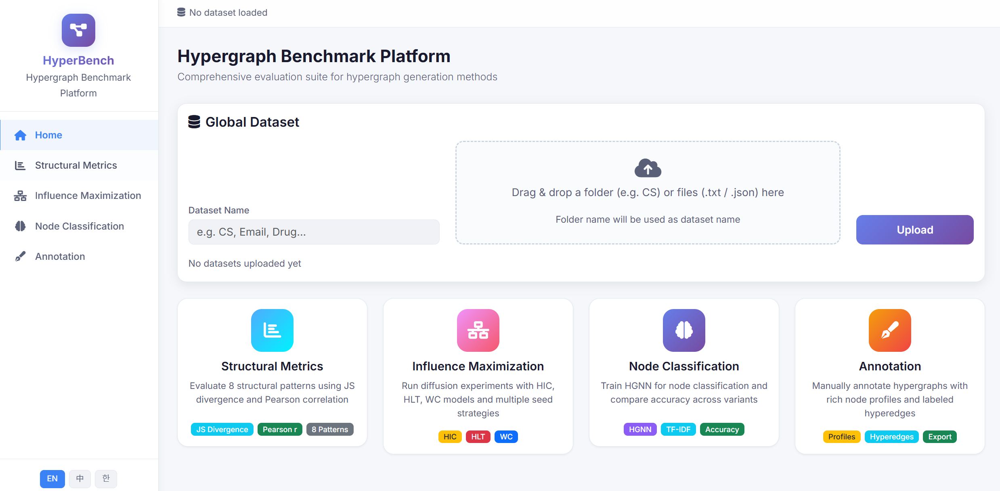

# Hypergraph-Benchmarks

A comprehensive Flask-based web platform for **hypergraph analysis, benchmarking, and annotation**. This platform integrates structural evaluation, influence maximization simulation, hypergraph neural network training, and a manual/AI-assisted hypergraph annotation system into a unified, interactive web interface.



---

## ✨ Features

### 1. Structural Metrics (P1–P8)

Evaluates eight fundamental structural patterns of real-world hypergraphs, adapted from MATLAB-based Hypergraph-Evaluation:

| # | Metric | Type | Comparison |
|---|--------|------|------------|
| P1 | Heavy-tailed degree distribution | Distribution | JS Divergence |
| P2 | Heavy-tailed hyperedge size distribution | Distribution | JS Divergence |
| P3 | Heavy-tailed intersection size distribution | Distribution | JS Divergence |
| P4 | Skewed singular value distribution | Trend | Pearson Correlation |
| P5 | Intersecting pairs | Trend | Pearson Correlation |
| P6 | Heavy-tailed group degree distribution | Distribution | JS Divergence |
| P7 | Heavy-tailed hypercoreness distribution | Distribution | JS Divergence |
| P8 | Power-law persistence | Distribution | JS Divergence |

- **Drag & drop** hyperedge `.txt` files or entire dataset folders
- **Real file locking**: automatically detects or prompts the user to select the ground-truth ("real") file; all synthetic files are compared against it
- Interactive **Plotly.js** charts for each metric

### 2. Influence Maximization (IM)

Simulates information diffusion on hypergraphs with three propagation models and multiple seed selection strategies, adapted from Hypergraph_IM:

- **Diffusion Models**: HIC (Hypergraph Independent Cascade), HLT (Hypergraph Linear Threshold), WC (Weighted Cascade)
- **Seed Strategies**: Random, Degree Centrality, PageRank
- Configurable seed set sizes and simulation rounds
- Real-time progress tracking and result visualization

### 3. HGNN Node Classification

Trains a Hypergraph Neural Network for node classification, adapted from Hypergraph-HGNN (Feng et al., AAAI 2019):

- **Input**: Hyperedge file (`.txt`) + Node attributes (`.json`)
- **Features**: TF-IDF text embeddings from node profiles
- Configurable hyperparameters (learning rate, epochs, hidden dimensions, train/val/test split)
- Displays training curves (loss & accuracy) and final test metrics

### 4. Hypergraph Annotation

A sub-platform for **manually constructing and annotating hypergraphs**, with optional **GPT-3.5 Turbo** AI assistance:

- **Network Types**: Collaboration, Social, Drug, Protein, and custom networks — each with tailored profile schemas
- **Label Management**: Predefine category labels for both hyperedges and node profiles
- **Profile Reuse**: Search existing node profiles by keyword and reuse across multiple hyperedges
- **Custom Fields**: Add arbitrary key-value attributes to any profile via a "+" button
- **AI-Assisted Parsing**: Paste paper abstracts or text blocks — GPT-3.5 Turbo automatically extracts authors, title, category, and abstract, matching against existing profiles
- **Export**: Download `profiles.json` and `hyperedges.txt` at any time

---

## 📁 Project Structure

```
Hypergraph-Benchmarks/
├── app.py                     # Main Flask application (routes + APIs)
├── requirements.txt           # Python dependencies
├── modules/
│   ├── structural_metrics.py  # P1–P8 structural analysis engine
│   ├── influence_maximization.py  # IM diffusion simulation
│   └── hgnn_classification.py     # HGNN training & evaluation
├── templates/
│   ├── base.html              # Base layout with navbar
│   ├── index.html             # Landing page
│   ├── structural.html        # Structural metrics UI
│   ├── im.html                # Influence maximization UI
│   ├── hgnn.html              # HGNN classification UI
│   └── annotate.html          # Annotation sub-platform UI
├── static/
│   ├── css/style.css          # Global styles (light theme)
│   └── js/main.js             # Frontend logic, i18n, drag-and-drop
├── uploads/                   # Uploaded datasets (auto-created)
└── annotations/               # Annotation project data (auto-created)
```

## 🚀 Getting Started

### Prerequisites

- Python 3.8+
- (Optional) CUDA-compatible GPU for HGNN training acceleration

### Installation

```bash
# Clone the repository
git clone https://github.com/<your-username>/Hypergraph-Benchmarks.git
cd Hypergraph-Benchmarks

# Install dependencies
pip install -r requirements.txt
```

### Run

```bash
python app.py
```

Open your browser and navigate to **http://localhost:5001**.

---

## 📊 Dataset Format

The platform expects hypergraph datasets in a simple text-based format:

| File | Format | Description |
|------|--------|-------------|
| `*-hyperedges.txt` | `node1 node2 node3 ...` per line | Each line is a hyperedge |
| `*.json` | `{"node_id": {"field": "value", ...}}` | Node attributes / profiles |
| `hyperedge-labels.txt` | One integer label per line | Hyperedge category labels |

You can drag and drop individual files **or entire dataset folders** (e.g., similar to `Hypergraph-Datasets/CS/`) directly into the platform.

## 🛠 Tech Stack

- **Backend**: Flask (Python), NumPy, SciPy, scikit-learn, PyTorch
- **Frontend**: HTML5, Bootstrap 5, Plotly.js, Font Awesome
- **Visualization**: Plotly.js (interactive charts), Matplotlib (server-side)

---

## 🙏 Acknowledgements

- HGNN model based on Feng et al., "Hypergraph Neural Networks" (AAAI 2019)
